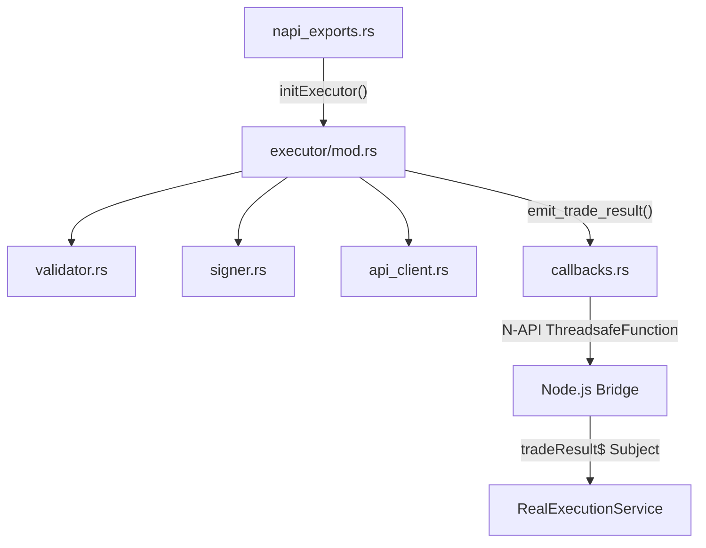
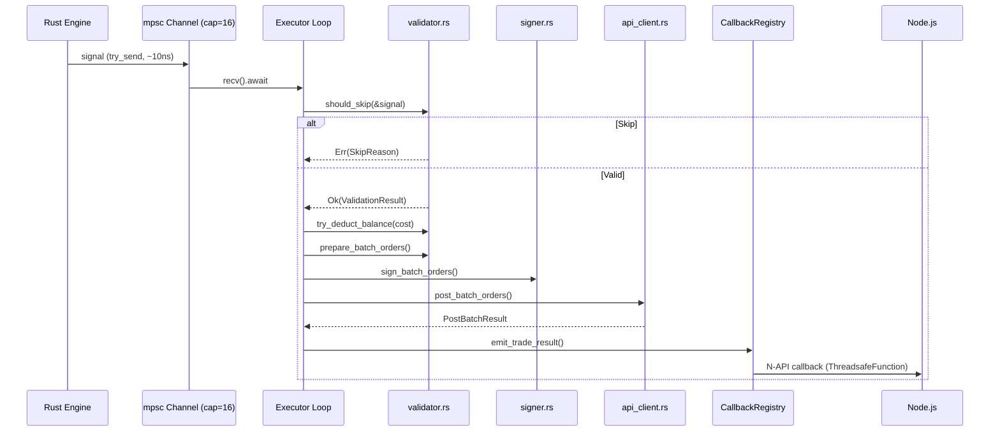
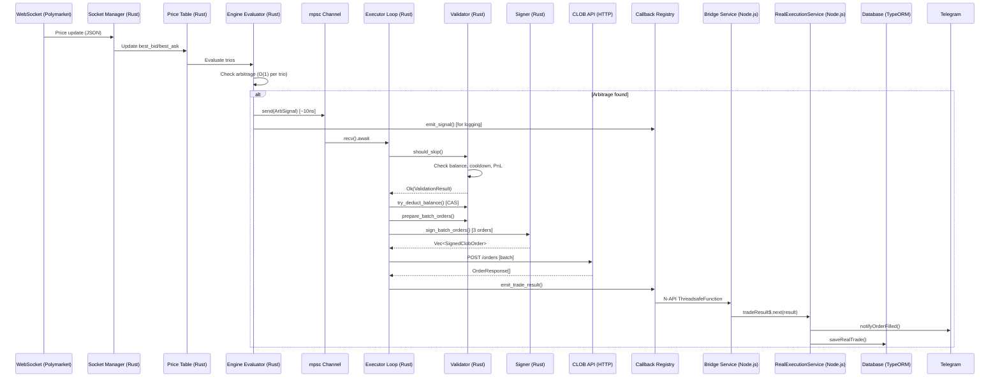

# Phase 3: Rust Executor — Technical Documentation

## Tổng Quan

Phase 3 chuyển toàn bộ execution pipeline từ Node.js sang Rust, bao gồm: **validate → sign → POST → callback**. Mục tiêu là giảm latency cho quá trình đặt lệnh (order placement), tận dụng hiệu suất cao của Rust cho các tác vụ CPU-bound (EIP-712 signing, JSON serialization) và I/O-bound (HTTP POST qua persistent connections).

### Vấn Đề Trước Phase 3

Trước đó, toàn bộ execution flow chạy trong Node.js (`RealExecutionService`):
1. **Validate**: Check balance, cooldown, PnL threshold → allocates objects
2. **Sign**: EIP-712 signing qua `native-core` N-API call → hex decode + curve creation mỗi lần
3. **POST**: axios HTTP POST → tạo connection mới mỗi request
4. **Handle Result**: DB save, Telegram, mint queue

**Bottleneck:** Mỗi bước tạo objects mới, GC pressure cao, không tận dụng được cache.

### Giải Pháp Phase 3

Chuyển bước 1–3 sang Rust, chỉ giữ bước 4 (DB save, Telegram) ở Node.js vì cần truy cập TypeORM/NestJS services. Kiến trúc mới:

```
WebSocket Price → Rust Engine → mpsc channel → Rust Executor → CLOB POST
                                                                    ↓
                                                        N-API callback → Node.js
                                                                    ↓
                                                          DB Save + Telegram
```

---

## Kiến Trúc Module

### File Structure

```
rust-core/src/
├── executor/
│   ├── mod.rs           # Executor loop (tokio task) + state management
│   ├── signer.rs        # EIP-712 signing (cached wallet, pre-computed domains)
│   ├── api_client.rs    # CLOB API client (HMAC-SHA256, persistent HTTP)
│   └── validator.rs     # Order validation, slippage, preparation
├── bridge/
│   ├── napi_exports.rs  # N-API functions: initExecutor, updateBalance, etc.
│   └── callbacks.rs     # CallbackRegistry: on_trade_result callback
└── types/
    └── order.rs         # OrderToSign, SignedClobOrder, TradeResult, etc.
```

### Dependency Flow



---

## Chi Tiết Từng Module

### 1. `executor/signer.rs` — EIP-712 Signing

**Mục đích:** Ký lệnh (order signing) theo chuẩn EIP-712 cho Polymarket CTF Exchange. Port từ `native-core/src/lib.rs` với tối ưu HFT.

#### Tối Ưu So Với Bản JS Cũ

| Aspect | JS (native-core) | Rust (signer.rs) |
|--------|-------------------|-------------------|
| Wallet creation | Parse hex + tạo curve **mỗi lần** gọi | Tạo 1 lần, cache trong `SignerState` |
| Domain separator | Compute **mỗi lần** ký | Pre-computed tại `init_executor()` |
| Buffer allocation | Tạo mới mỗi lần | `Vec::with_capacity()` pre-alloc |

#### Struct Chính

```rust
pub struct SignerState {
    pub wallet: LocalWallet,               // Cached, tạo 1 lần
    pub maker_address: Address,            // Proxy address (Gnosis Safe)
    pub signer_address: Address,           // Wallet address (EOA)
    pub taker_address: Address,            // Always 0x0
    pub domain_separator_standard: [u8; 32],  // Pre-computed
    pub domain_separator_neg_risk: [u8; 32],  // Pre-computed
}
```

#### Flow Ký Lệnh

```
OrderToSign → compute_order_struct_hash() → compute_typed_data_hash() → wallet.sign_hash() → SignedClobOrder
```

1. **`compute_order_struct_hash()`**: ABI-encode 12 fields (salt, maker, signer, taker, tokenId, makerAmount, takerAmount, expiration, nonce, feeRateBps, side, signatureType) rồi keccak256
2. **`compute_typed_data_hash()`**: `keccak256(0x1901 || domainSeparator || structHash)` — chuẩn EIP-712
3. **`wallet.sign_hash()`**: ECDSA signing trên Secp256k1 curve

#### Constants

| Constant | Value | Mô tả |
|----------|-------|-------|
| `CHAIN_ID` | 137 | Polygon Mainnet |
| `VERIFYING_CONTRACT` | `0x4bFb...982E` | Standard CTF Exchange |
| `NEG_RISK_VERIFYING_CONTRACT` | `0xC5d5...f80a` | NegRisk CTF Exchange |
| `SIGNATURE_TYPE_POLY_GNOSIS_SAFE` | 2 | Gnosis Safe signing scheme |

---

### 2. `executor/api_client.rs` — CLOB API Client

**Mục đích:** HTTP POST batch orders đến Polymarket CLOB API. Thay thế `placeBatchOrdersAxios()` trong `PolymarketOnchainService`.

#### Tối Ưu HFT

```rust
let client = reqwest::Client::builder()
    .tcp_nodelay(true)              // Disable Nagle's algorithm
    .pool_idle_timeout(Duration::from_secs(30))  // Keep-alive
    .pool_max_idle_per_host(10)     // Connection pooling
    .timeout(Duration::from_secs(5))
    .build()?;
```

- **`tcp_nodelay(true)`**: Gửi packet ngay, không chờ buffer đầy (Nagle's algorithm off)
- **Connection pooling**: Tái sử dụng TCP connections, tránh TLS handshake lặp lại
- **Pre-decoded secret**: Base64 decode API secret 1 lần tại init, lưu `Vec<u8>`

#### HMAC-SHA256 Authentication

```
message = "{timestamp}{method}{requestPath}{body}"
signature = HMAC-SHA256(decoded_secret, message)
result = base64_url_safe(signature)  // '+' → '-', '/' → '_'
```

Headers gửi đi:
```
POLY_ADDRESS: {signerAddress}
POLY_SIGNATURE: {hmacSignature}
POLY_TIMESTAMP: {unixTimestampSecs}
POLY_API_KEY: {apiKey}
POLY_PASSPHRASE: {apiPassphrase}
```

#### Batch Order Payload Format

```json
[
  {
    "deferExec": false,
    "order": {
      "salt": 12345,
      "maker": "0x...",
      "signer": "0x...",
      "taker": "0x0000...0000",
      "tokenId": "999...",
      "makerAmount": "1000000",
      "takerAmount": "2000000",
      "side": "BUY",
      "expiration": "0",
      "nonce": "0",
      "feeRateBps": "0",
      "signatureType": 2,
      "signature": "0x..."
    },
    "owner": "{apiKey}",
    "orderType": "GTC"
  }
]
```

---

### 3. `executor/validator.rs` — Order Validation & Preparation

**Mục đích:** Validate signal, tính slippage, chuẩn bị orders. Port từ `RealExecutionService` methods: `shouldSkip()`, `applySlippage()`, `prepareBatchOrdersSync()`.

#### Validation State (Lock-free)

```rust
pub struct ValidationState {
    pub usdc_balance: AtomicU64,      // f64 bits stored as u64
    pub trading_enabled: AtomicBool,
    pub is_submitting: AtomicBool,
    pub last_executed_at: AtomicU64,  // epoch ms
}
```

**Tại sao dùng Atomic thay vì Mutex?**
- Hot path (signal evaluation) chạy trên tokio task
- Balance update chạy từ Node.js thread (N-API call)
- Atomic operations: ~5ns vs Mutex lock: ~25ns
- `AtomicU64` lưu f64 qua `f64::to_bits()` / `f64::from_bits()`

#### `try_deduct_balance()` — Optimistic Balance Deduction

```rust
pub fn try_deduct_balance(&self, amount: f64) -> bool {
    loop {
        let current_bits = self.usdc_balance.load(Ordering::Relaxed);
        let current = f64::from_bits(current_bits);
        if current < amount { return false; }
        let new_balance = current - amount;
        match self.usdc_balance.compare_exchange_weak(
            current_bits, new_balance.to_bits(),
            Ordering::Relaxed, Ordering::Relaxed,
        ) {
            Ok(_) => return true,
            Err(_) => continue, // CAS retry on contention
        }
    }
}
```

**Cơ chế:** Compare-And-Swap (CAS) loop — deduct balance trước khi POST, restore nếu fail. Tránh race condition khi nhiều signal đến cùng lúc.

#### Validation Flow (`should_skip()`)

```
Signal → trading_enabled? → is_submitting? → cooldown check
                                                ↓
                                        build_order_candidates()
                                                ↓
                                        PnL threshold check
                                                ↓
                                        size validation
                                                ↓
                                        balance check
                                                ↓
                                        Ok(ValidationResult)
```

| Check | Điều kiện bỏ qua | Skip Reason |
|-------|-------------------|-------------|
| Trading enabled | `trading_enabled == false` | `TradingDisabled` |
| Submitting guard | `is_submitting == true` | `AlreadySubmitting` |
| Cooldown | `now - last_executed < timeout_ms` | `CooldownActive` |
| Candidates | Không có orders hợp lệ | `NoCandidates` |
| PnL threshold | `pnl% < min_threshold%` | `PnlBelowThreshold` |
| Size | `size < 5.0 || !isFinite` | `InvalidSize` |
| Balance | `balance < required_cost` | `InsufficientBalance` |

#### Strategy → Order Candidates Mapping

| Strategy | Leg 1 | Leg 2 | Leg 3 |
|----------|-------|-------|-------|
| `POLYMARKET_TRIANGLE_BUY` | BUY parent YES (ask) | BUY parent_upper NO (ask) | BUY child NO (ask) |
| `SELL_PARENT_BUY_CHILDREN` | SELL parent (bid) | BUY parent_upper (ask) | BUY child (ask) |
| `BUY_PARENT_SELL_CHILDREN` | BUY parent (ask) | SELL parent_upper (bid) | SELL child (bid) |

#### Slippage (Tick Size Mechanism)

```rust
const SLIPPAGE_EXTREME_THRESHOLD_HIGH: f64 = 0.96;
const SLIPPAGE_EXTREME_THRESHOLD_LOW: f64 = 0.04;
const NORMAL_SPREAD: f64 = 0.01;   // 1 cent
const EXTREME_SPREAD: f64 = 0.001; // 0.1 cent
```

| Price Range | Spread | BUY (add) | SELL (subtract) |
|-------------|--------|-----------|-----------------|
| 0.04 < p < 0.96 | 0.01 | p + 0.01 | p - 0.01 |
| p ≤ 0.04 or p ≥ 0.96 | 0.001 | p + 0.001 | p - 0.001 |

Capped: BUY ≤ 0.99, SELL ≥ 0.01.

#### Order Amount Calculation

```
size_rounded = round(size, 2)      // e.g., 10.00
usdc_raw = price × size_rounded    // e.g., 0.51 × 10.00 = 5.10
usdc_rounded = round(usdc_raw, 4)  // e.g., 5.1000

BUY:  makerAmount = round(usdc_rounded × 1_000_000)  // USDC (6 decimals)
      takerAmount = round(size_rounded × 1_000_000)   // Asset
SELL: makerAmount = round(size_rounded × 1_000_000)   // Asset
      takerAmount = round(usdc_rounded × 1_000_000)   // USDC
```

---

### 4. `executor/mod.rs` — Executor Loop

**Mục đích:** Orchestrate toàn bộ execution flow. Chạy như một tokio task, nhận signals qua mpsc channel.

#### Executor State

```rust
pub struct ExecutorState {
    pub signer: SignerState,            // Cached wallet + domain separators
    pub api_client: ClobApiClient,      // Persistent HTTP client
    pub config: ExecutorConfig,         // Runtime config
    pub validation: Arc<ValidationState>, // Shared atomic state
    pub api_key: String,                // Used as "owner" in batch payload
}
```

#### Signal Processing Flow



#### Dual-Path Signal Dispatch

Khi engine phát hiện arbitrage opportunity:

```rust
for signal in signals {
    // Path 1: Send to Rust executor (zero-copy, ~10ns)
    if let Some(tx) = EXECUTOR_TX.get() {
        let _ = tx.try_send(signal.clone());
    }
    // Path 2: Emit to Node.js (for logging/monitoring)
    registry.emit_signal(signal).await;
}
```

- **Path 1 (mpsc)**: Signal gửi trực tiếp đến executor qua tokio mpsc channel — không cần serialize/deserialize, latency ~10ns
- **Path 2 (N-API)**: Signal cũng gửi về Node.js qua ThreadsafeFunction — chỉ để logging, không block execution

#### Error Recovery

Khi signing hoặc POST fail:
```rust
// Signing failed → restore balance
let balance = state.validation.get_balance();
state.validation.set_balance(balance + validation_result.required_cost);
state.validation.is_submitting.store(false, Ordering::Release);

// POST failed → restore balance
if !post_result.success {
    let balance = state.validation.get_balance();
    state.validation.set_balance(balance + validation_result.required_cost);
}
```

---

### 5. `bridge/napi_exports.rs` — N-API Functions

#### Executor API Surface

| Function | Signature | Mô tả |
|----------|-----------|--------|
| `initExecutor` | `(config: NapiExecutorConfigInput) → void` | Khởi tạo signer, HTTP client, spawn executor loop |
| `onTradeResult` | `(callback: (result: TradeResult) → void) → void` | Đăng ký callback nhận kết quả trade |
| `updateBalance` | `(usdcBalance: number) → void` | Cập nhật USDC balance cho validator |
| `setTradingEnabled` | `(enabled: boolean) → void` | Bật/tắt trading runtime |

#### NapiExecutorConfigInput

```typescript
interface NapiExecutorConfigInput {
    privateKey: string;           // Wallet private key (hex)
    proxyAddress: string;         // Gnosis Safe proxy address
    signerAddress: string;        // Wallet EOA address (derived from privateKey)
    apiKey: string;               // Polymarket API key
    apiSecret: string;            // Polymarket API secret (base64)
    apiPassphrase: string;        // Polymarket API passphrase
    clobUrl?: string;             // Default: "https://clob.polymarket.com"
    minPnlThresholdPercent: number; // Min PnL% to execute
    defaultSize: number;          // Order size in USDC
    slippageEnabled: boolean;     // Enable slippage adjustment
    opportunityTimeoutMs?: number; // Cooldown between executions (default: 5000)
}
```

#### Global State Management

```rust
static EXECUTOR_STATE: OnceLock<Arc<ExecutorState>>  // Initialized once
static EXECUTOR_TX: OnceLock<mpsc::Sender<ArbSignal>> // Channel sender
static RUNTIME: OnceLock<tokio::runtime::Runtime>    // 3 worker threads
```

Tokio runtime dùng chung cho Socket + Engine + Executor (3 worker threads).

---

### 6. `bridge/callbacks.rs` — Callback Registry

```rust
pub struct CallbackRegistry {
    on_top_of_book: Mutex<Option<ThreadsafeFunction<TopOfBookUpdate>>>,
    on_signal: Mutex<Option<ThreadsafeFunction<ArbSignal>>>,
    on_trade_result: Mutex<Option<ThreadsafeFunction<TradeResult>>>,
}
```

- Sử dụng `ThreadsafeFunction` (N-API) để gọi JS callback từ Rust thread
- `NonBlocking` mode: Không chờ JS callback hoàn thành, tránh block executor
- Global singleton qua `OnceLock<Arc<CallbackRegistry>>`

---

### 7. `types/order.rs` — Type Definitions

#### Internal Types (Rust-only, no N-API overhead)

| Type | Mô tả |
|------|--------|
| `OrderToSign` | Input cho signer: salt, tokenId, makerAmount, takerAmount, side(u8), negRisk |
| `SignedClobOrder` | Output của signer: thêm maker/signer/taker addresses, signature hex |
| `OrderCandidate` | Intermediate: tokenId, price, side(enum), orderbookSize, negRisk |
| `OrderSide` | Enum: `Buy(0)` / `Sell(1)` |

#### N-API Types (Rust ↔ Node.js)

| Type | Direction | Mô tả |
|------|-----------|--------|
| `TradeResult` | Rust → Node.js | success, orderIds, failedOrders, costs, PnL, latency |
| `NapiFailedOrder` | Rust → Node.js | tokenId, side, price, errorMsg |
| `NapiExecutorConfigInput` | Node.js → Rust | privateKey, API creds, trading params |

---

## Node.js Integration

### `rust-engine-bridge.service.ts`

**Vai trò:** NestJS service kết nối Node.js app với Rust core. Quản lý lifecycle của cả engine và executor.

#### Executor Initialization Flow

```typescript
async initRustExecutor(): Promise<void> {
    const polyConfig = loadPolymarketConfig();
    const wallet = new ethers.Wallet(polyConfig.privateKey);

    this.rustCore.initExecutor({
        privateKey: polyConfig.privateKey,
        proxyAddress: polyConfig.proxyAddress,
        signerAddress: wallet.address,        // Derived from private key
        apiKey: polyConfig.apiKey,
        apiSecret: polyConfig.apiSecret,
        apiPassphrase: polyConfig.apiPassphrase,
        clobUrl: polyConfig.clobUrl,
        minPnlThresholdPercent: parseFloat(process.env.ARB_MIN_PNL_THRESHOLD || '0.1'),
        defaultSize: parseFloat(process.env.REAL_TRADE_SIZE || '10'),
        slippageEnabled: process.env.SLIPPAGE_ENABLED === 'true',
        opportunityTimeoutMs: parseInt(process.env.ARB_COOLDOWN_MS || '5000', 10),
    });

    // Register trade result callback
    this.rustCore.onTradeResult((result) => {
        this.tradeResult$.next(result);  // Emit to subscribers
    });

    // Set initial trading state
    this.rustCore.setTradingEnabled(process.env.REAL_TRADING_ENABLED === 'true');

    // Start background balance refresh (every 5s)
    this.startBalanceRefresh();
}
```

#### Background Balance Refresh

```typescript
private startBalanceRefresh(): void {
    this.balanceRefreshInterval = setInterval(async () => {
        const balanceStr = await this.redisService.get(WORKER_USDC_BALANCE_KEY);
        if (balanceStr !== null) {
            const balance = parseFloat(balanceStr) || 0;
            this.rustCore.updateBalance(balance);
        }
    }, 5000);  // Every 5 seconds
}
```

Reads balance from Redis (written by Worker process via RPC call — avoids RPC latency on main process).

### `real-execution.service.ts`

**Thay đổi:** Khi `EXECUTOR_MODE=rust`, service không chạy JS execution path mà subscribe vào `onTradeResult()` từ Rust.

#### Trade Result Subscription

```typescript
// In constructor/init:
if (process.env.EXECUTOR_MODE === 'rust' && this.rustEngineBridgeService.executorIsActive) {
    this.rustEngineBridgeService.onTradeResult().subscribe((result) => {
        this.handleRustTradeResult(result);
    });
}
```

#### `handleRustTradeResult()` — Xử Lý Kết Quả Từ Rust

```
RustTradeResult → Telegram notification → DB save (ArbRealTrade) → Manage position queue
```

- **Telegram**: Notify thành công/thất bại + order details
- **DB**: Lưu trade result vào `ArbRealTrade` entity (bao gồm signalId, costs, PnL, latency)
- **Manage Position Queue**: Đưa orderIds vào Bull queue để Worker process track order status

#### Trading Toggle Propagation

```typescript
enableTrading() {
    this.runtimeEnabled = true;
    // Propagate to Rust executor
    this.rustEngineBridgeService.setTradingEnabled(true);
}

disableTrading() {
    this.runtimeEnabled = false;
    this.slippageEnabled = false;
    this.rustEngineBridgeService.setTradingEnabled(false);
}
```

---

## Environment Variables

| Variable | Type | Default | Mô tả |
|----------|------|---------|--------|
| `ENGINE_MODE` | `rust` / `js` | `js` | Chọn signal engine |
| `EXECUTOR_MODE` | `rust` / `js` | `js` | Chọn execution path |
| `REAL_TRADING_ENABLED` | `true` / `false` | `false` | Trading state ban đầu |
| `REAL_TRADE_SIZE` | number | `10` | Kích thước order (USDC) |
| `SLIPPAGE_ENABLED` | `true` / `false` | `false` | Bật slippage adjustment |
| `ARB_MIN_PNL_THRESHOLD` | number | `0.1` | Min PnL% để thực thi |
| `ARB_COOLDOWN_MS` | number | `5000` | Cooldown giữa các lần execute |
| `ARB_MIN_PROFIT_BPS` | number | `5` | Min profit (basis points) cho engine |
| `ARB_MIN_PROFIT_ABS` | number | `0` | Min profit absolute ($) cho engine |

### Deployment Modes

| Mode | `ENGINE_MODE` | `EXECUTOR_MODE` | Mô tả |
|------|---------------|-----------------|--------|
| Full JS | `js` | `js` | Không sử dụng Rust (default) |
| Rust Engine only | `rust` | `js` | Signal detection bằng Rust, execution bằng JS |
| Full Rust | `rust` | `rust` | Toàn bộ pipeline bằng Rust |

> **Lưu ý:** `EXECUTOR_MODE=rust` chỉ hoạt động khi `ENGINE_MODE=rust` (executor cần Rust engine để nhận signals qua mpsc channel).

---

## Rust Dependencies (Cargo.toml)

| Crate | Version | Mục đích |
|-------|---------|----------|
| `napi` | 2 | N-API bindings (Node.js ↔ Rust) |
| `tokio` | 1 (full) | Async runtime (socket + executor) |
| `reqwest` | 0.12 | HTTP client (persistent connections) |
| `ethers-core` | 2 | EIP-712 types (Address, U256, keccak256) |
| `ethers-signers` | 2 | LocalWallet (ECDSA signing) |
| `hmac` | 0.12 | HMAC-SHA256 (API authentication) |
| `sha2` | 0.10 | SHA-256 hash (cho HMAC) |
| `base64` | 0.22 | Base64 encode/decode (API secret, signature) |
| `hex` | 0.4 | Hex encode/decode (private key, signature) |
| `rand` | 0.8 | Random number generation (salt) |
| `simd-json` | 0.14 | SIMD-accelerated JSON parsing |

### Release Profile

```toml
[profile.release]
opt-level = 3        # Maximum optimization
lto = true           # Link-Time Optimization (cross-crate inlining)
codegen-units = 1    # Single codegen unit (better optimization)
strip = true         # Strip debug symbols
```

---

## Test Coverage

### Rust Tests (`cargo test`)

| Module | Tests | Mô tả |
|--------|-------|--------|
| `signer.rs` | 5 | Domain separator computation, U256 parsing, wallet creation, deterministic signing |
| `api_client.rs` | 2 | HMAC signature format (URL-safe base64), deterministic signatures |
| `validator.rs` | 8 | Slippage (normal/extreme, buy/sell, cap/floor), rounding, spread calculation, balance CAS |
| **Total** | **15** executor tests | (+ 23 tests from engine/socket/evaluator) |

### TypeScript Compilation

```bash
npx tsc --noEmit  # 0 errors
```

---

## So Sánh Latency (Dự Kiến)

| Operation | JS (trước Phase 3) | Rust (Phase 3) | Improvement |
|-----------|---------------------|-----------------|-------------|
| EIP-712 signing (3 orders) | ~2-5ms | ~50-100µs | ~30-50x |
| HMAC signature | ~0.5ms | ~5µs | ~100x |
| HTTP POST (same endpoint) | ~50-200ms | ~30-150ms | ~1.3x (TCP_NODELAY) |
| Signal → Executor dispatch | ~0.1ms (N-API call) | ~10ns (mpsc) | ~10,000x |
| Validation checks | ~0.05ms | ~1µs | ~50x |
| **Total (excl. network)** | **~3-6ms** | **~60-110µs** | **~30-50x** |

> Network latency (HTTP POST roundtrip) chiếm phần lớn tổng thời gian và không thể giảm đáng kể qua code optimization. Lợi ích chính của Rust executor là giảm **CPU time** và **GC pressure** trên Node.js main thread.

---

## Sequence Diagram: Full Execution Flow


